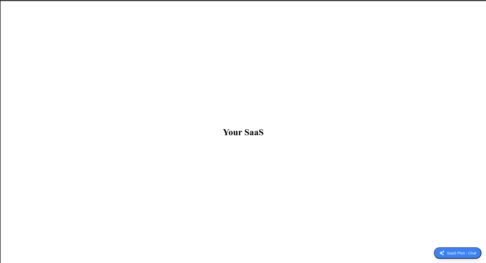
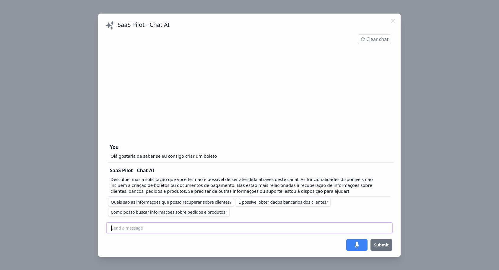
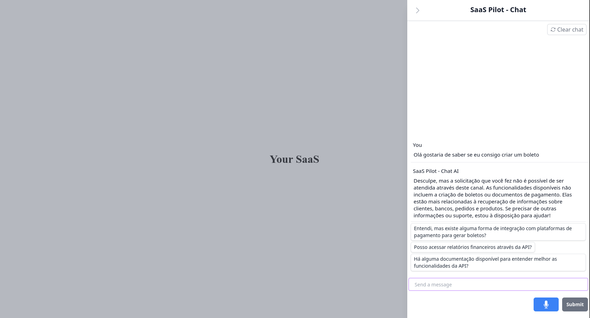

# SaaS Pilot - Integration Examples

Welcome to the **SaaS Pilot** examples repository! Here you will find practical examples on how to integrate the chat features of the SaaS Pilot platform using UMD (Universal Module Definition) in both **Modal** and **Sidebar** formats.




## Installation

To use the integration examples, simply include the following script in your HTML project.

```html
<script src="https://cdn.jsdelivr.net/npm/@saaspilot/chat-ui/dist/saaspilot-chat.umd.js"></script>
```

Once the script is included, you can easily initialize the chat as shown in the examples below.

---

## Examples

### 1. Modal

The example below shows how to integrate the chat in **Modal** format.



```html
<script src="https://cdn.jsdelivr.net/npm/@saaspilot/chat-ui/dist/saaspilot-chat.umd.js"></script>
<script>
    let saaspchat;
    window.addEventListener('load', function() {
        if (typeof SaaspilotChat !== 'undefined' && typeof SaaspilotChat.initSaaspChat === 'function') {
            saaspchat = SaaspilotChat.initSaaspChat({
                saaspilotUrl: 'https://www.saaspilot.ai',
                saaspilotApiKey: 'saaspk-0*************************',
                AIname: 'SaaS Pilot - Chat',
                displayType: 'modal',
                initialOpen: false,
                userApiKey: 'your-api-key-for-accessing-your-api', // Required for API calls. Never stored in our database.
                userDescription: 'Provide context about the user and any useful information for accessing your API', // Optional
                showFloatingButton: true, // Set to false to hide default button and control programmatically
                speechLanguage: 'en-US'
            });

            // Programmatic control examples:
            // saaspchat.open();  // Open chat programmatically
            // saaspchat.close(); // Close chat programmatically
        }
    });
</script>
```

### 2. Sidebar

The example below shows how to integrate the chat in **Sidebar** format.



```html
<script src="https://cdn.jsdelivr.net/npm/@saaspilot/chat-ui/dist/saaspilot-chat.umd.js"></script>
<script>
    let saaspchat;
    window.addEventListener('load', function() {
        if (typeof SaaspilotChat !== 'undefined' && typeof SaaspilotChat.initSaaspChat === 'function') {
            saaspchat = SaaspilotChat.initSaaspChat({
                saaspilotUrl: 'https://www.saaspilot.ai',
                saaspilotApiKey: 'saaspk-0*************************',
                AIname: 'SaaS Pilot - Chat',
                displayType: 'sidebar',
                sidebarPosition: 'right',
                initialOpen: false,
                userApiKey: 'your-api-key-for-accessing-your-api', // Required for API calls. Never stored in our database.
                userDescription: 'Provide context about the user and any useful information for accessing your API', // Optional
                showFloatingButton: true, // Set to false to hide default button and control programmatically
                speechLanguage: 'en-US'
            });

            // Programmatic control examples:
            // saaspchat.open();  // Open chat programmatically
            // saaspchat.close(); // Close chat programmatically
        }
    });
</script>
```

---

## Directory Structure

The repository contains the following directories with examples on how to integrate the chat:

- **modal/**: Examples of integration using the modal format.
- **sidebar/**: Examples of integration using the sidebar format.

---

## Programmatic Control

You can control the opening and closing of the chat programmatically using the following methods:

```javascript
saaspchat.open();  // Open chat
saaspchat.close(); // Close chat
```

Remember, you can configure the chat to open or close automatically or even hide the floating button, depending on your needs.
